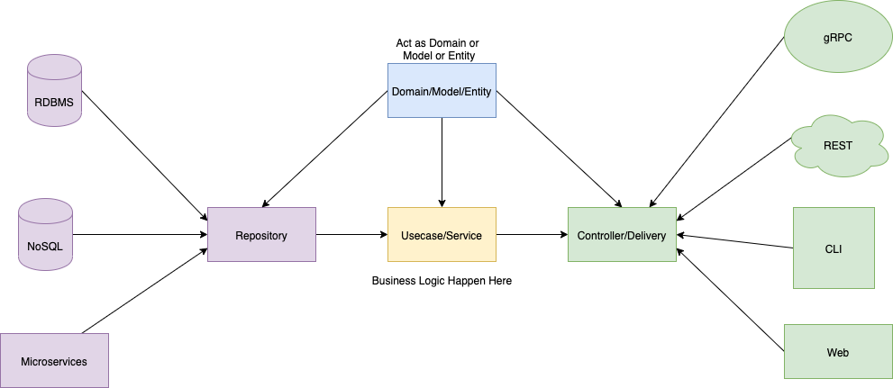

# Architecture

## app 项目结构
- controller: handler 层， 对应第一张图片中的绿色部分。目的是与 **use cases**隔离开来，比如后续 RPC 想要替换成 HTTP，只需要修改 handler 层的部分，use case 是不需要做任何修改的，也体现出use case 与**外部框架无关**的特点（本质就是解耦了）。
- usecases：实现业务业务的地方，对应三层架构中的 service层。
- entities：定义出在 handler, usecase, dao 层之间的实体对象操作，也是整个业务的核心实体。此外，各个**接口的定义**也在这里。属于整个架构的顶层，所以层都直接依赖于 entities。
- repository：对应外部依赖，比如 mysql，redis，kafka 等。
### 名词解释
- port：接口，与 golang 中的关键字 interface 做了区分，意思是一样的
- adapter：实现 port 的具体类
